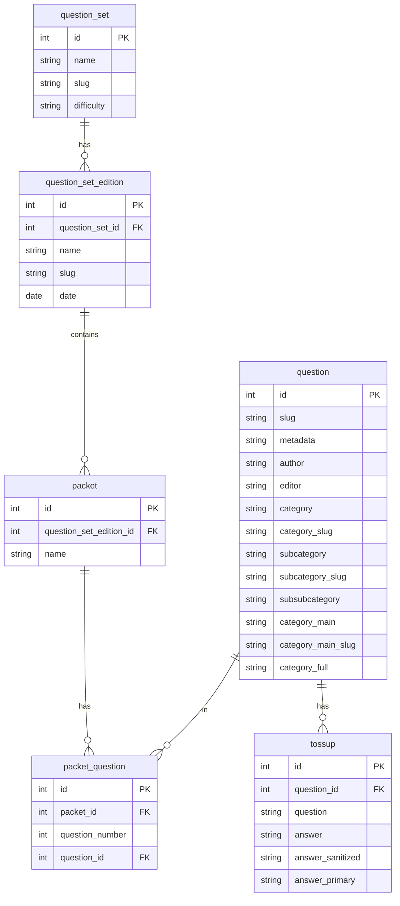
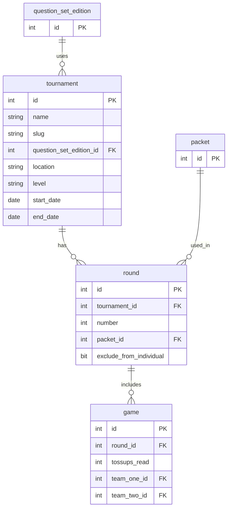
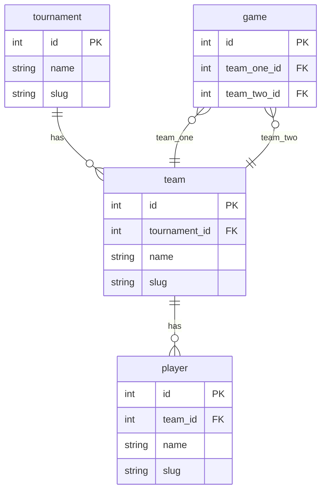
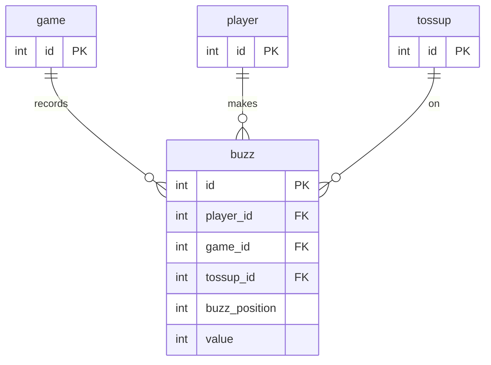

ACF Regionals Tournament Structure
=
This document describes the process and structure of the Regionals tournament in the Science Bowl competition.

## Overview

Regionals is a crucial stage in the National Science Bowl competition. It serves as a qualifying round for teams to advance to the National Finals. Regional competitions are held across the United States, typically organized by Department of Energy (DOE) laboratories or field offices.

## Structure

1. **Tournament**: The tournament is organized into rounds, with each round consisting of multiple games. Each tournament uses a specific edition of a question set.

2. **Game / Round**: Each game is a match between two teams within a round. A round may use a particular packet of questions. The game records various interactions, including players' attempts to answer toss-up questions (buzzes).

3. **Teams**: Each school can send one or more teams to compete at the regional level. A team usually consists of 4-5 students and a coach.

4. **Questions**: Questions are divided into two types:
   - **Toss-up**: Open to all team members to answer during a game.
   - **Bonus**: Only available to the team that correctly answers the corresponding toss-up question.

   Questions cover a wide range of scientific disciplines, including Biology, Chemistry, Earth and Space Science, Energy, Mathematics, and Physics.

5. **Scoring**: Points are awarded for correct answers, with toss-up questions typically worth 10 points and bonus questions worth 10 points. An incorrect answer results in a negative score of -5 points.

## Entities

To better understand the tournament structure, here are the key entities involved:

- **question_set**: A collection of questions grouped by a common theme or difficulty.
- **question_set_edition**: A specific edition of a question set, which may be updated or revised over time.
- **packet**: A set of questions used in a specific round or match.
- **packet_question**: A mapping between packets and questions, indicating which questions are included in which packets.
- **question**: An individual question, including metadata such as author, category, and difficulty.
- **tournament**: A specific tournament, including details such as name, location, and dates.
- **round**: A specific round within a tournament, which may use a particular packet of questions.
- **game**: A match between two teams within a round.
- **team**: A team participating in the tournament.
- **player**: An individual player on a team.
- **tossup**: An instance of a question that is asked in a game and is open to all team members to answer.
- **buzz**: A player's attempt to answer a tossup question, including the position and value of the buzz.

These entities form the foundation of the tournament's structure and organization.

#### __Question Organization__

- **question_set**: Represents a collection of questions grouped by a common theme or difficulty.
- **question_set_edition**: A specific edition of a question set, which may be updated or revised over time.
- **packet**: A set of questions used in a specific round or match.
- **packet_question**: A mapping between packets and questions, indicating which questions are included in which packets.
- **question**: Represents an individual question, including metadata such as author, category, and difficulty.
- **tossup**: A type of question that is open to all team members to answer.

#### __Tournament / Game Organization__

- **tournament**: Represents a specific tournament, including details such as name, location, and dates.
- **round**: A specific round within a tournament, which may use a particular packet of questions.
- **game**: A match between two teams within a round.
- **question_set_edition**: (Repeated from above) A specific edition of a question set.
- **packet**: (Repeated from above) A set of questions used in a specific round or match.

#### __Player/Team Organization__

**Entities:**

- **team**: Represents a team participating in the tournament.
- **player**: Represents an individual player on a team.
- **tournament**: (Repeated from above) Represents a specific tournament.
- **game**: (Repeated from above) A match between two teams within a round.

### __Player/Question Interaction__ 

