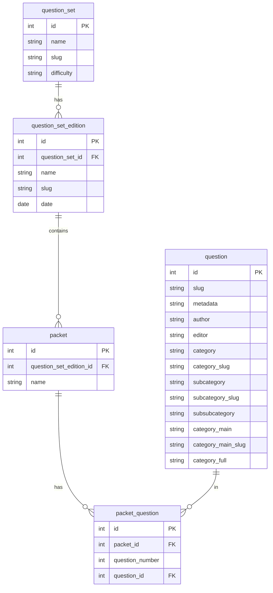
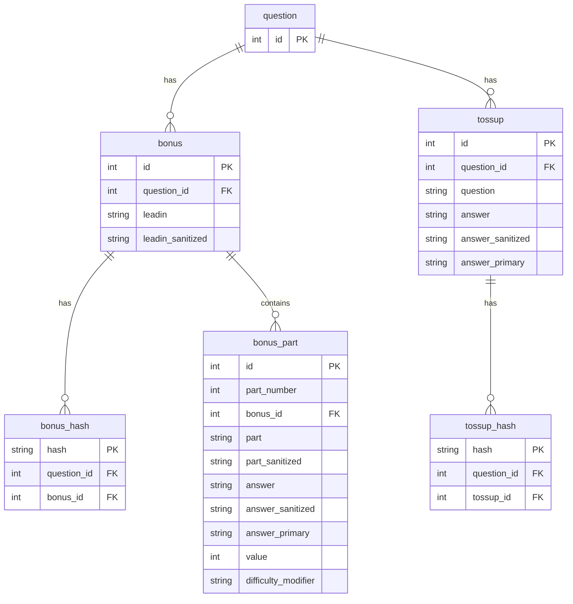
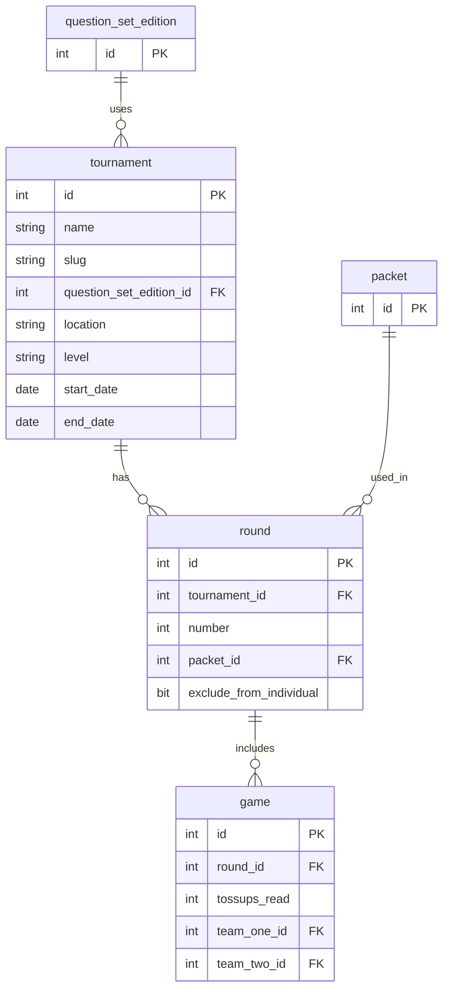
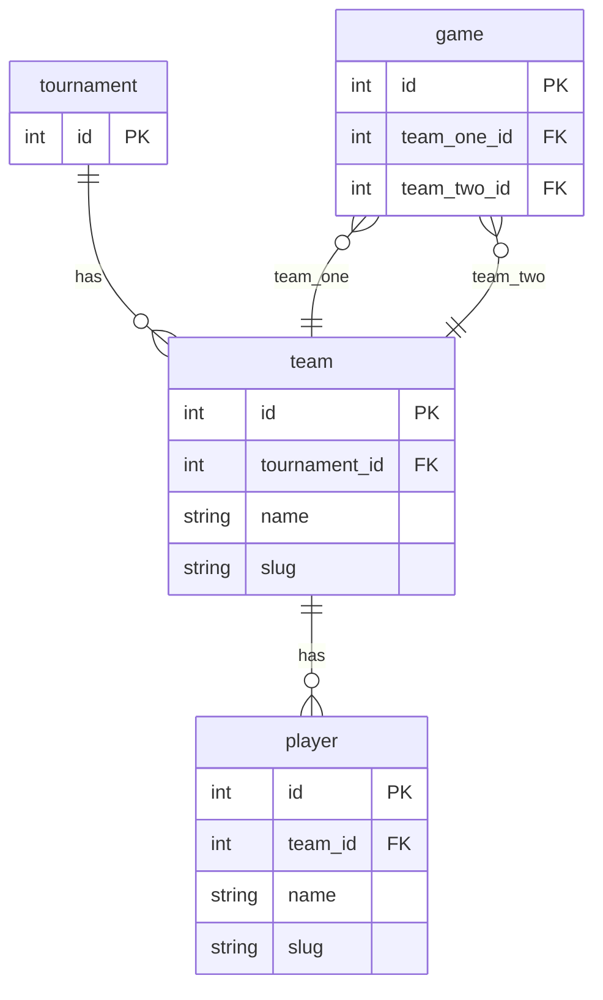
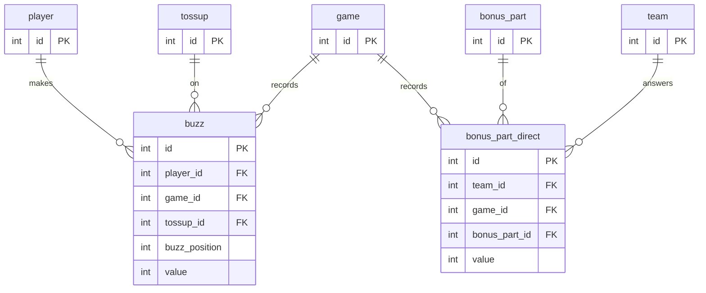

ACF Tournament Structure
=
This document describes the process and structure of an ACF tournament, the concepts and entities involved, and the relationships between them --- the database schema.

## Structure

1. **Tournament**: The tournament is organized into rounds, with each round consisting of multiple games. Each tournament uses a specific edition of a question set.

2. **Game / Round**: Each game is a match between two teams within a round. A round may use a particular packet of questions. The game records various interactions, including players' attempts to answer toss-up questions (buzzes).

3. **Teams**: Each school can send one or more teams to compete at the regional level. A team usually consists of 4-5 students and a coach.

4. **Questions**: Questions are divided into two types:
   - **Toss-up**: Open to all team members to answer during a game.
   - **Bonus**: Only available to the team that correctly answers the corresponding toss-up question.

   Questions cover a wide range of scientific disciplines, including Biology, Chemistry, Earth and Space Science, Energy, Mathematics, and Physics.

5. **Scoring**: Points are awarded for correct answers, with toss-up questions typically worth 10 points and bonus questions worth 10 points. An incorrect answer results in a negative score of -5 points.

## Entities and Relationships

To better understand the full scope of the database and the data model, let's break it down into its core components:

- **team**: A team participating in the tournament.
- **player**: An individual player on a team.
- **buzz**: A player's attempt to answer a tossup question, including the position and value of the buzz.

These entities form the foundation of the tournament's structure and organization.

#### __Question Organization__

- `question_set`: A collection of questions grouped by a common theme or difficulty.
- `question_set_edition`: A specific edition of a question set, which may be updated or revised over time.
- `packet`: A set of questions used in a specific round or match.
- `packet_question`: A mapping between packets and questions, indicating which questions are included in which packets.
- `question`: An individual question, including metadata such as author, category, and difficulty.

- `tossup`: An instance of a question that is asked in a game and is open to all team members to answer.
- `bonus`: A type of question that is only available to the team that correctly answers the corresponding tossup question.
- `bonus_part`: A part of a bonus question, including the part number, the part text, and the answer to the part.
- `bonus_hash`: A mapping between a bonus question and its corresponding hash.
- `tossup_hash`: A mapping between a tossup question and its corresponding hash.

#### __Games Organization__

- `tournament`: A specific tournament, including details such as name, location, and dates. e.g. "2024 Midwest Regional", "2024 Indiana State Fair Classic", "2024 Nationals"
- `round`: A specific round within a tournament, which may use a particular packet of questions.
- `game`: A match between two teams within a round.

#### __Player/Team Organization__

- `team`: Represents a team participating in the tournament.
- `player`: Represents an individual player on a team.

### __Player/Team Interaction with Questions__ 

