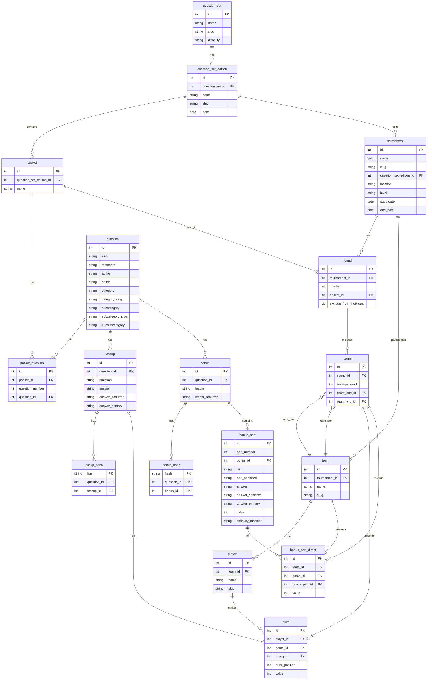

# ACF Nationals 2024 Quiz Database

This project contains data analysis for the Academic Competition Federation (ACF) Nationals 2024 quiz tournament.

## Database Structure

The project uses an SQLite database (`nats24.db`) to store various tables related to the tournament. Here's a summary of the main tables and their contents:

1. **Teams**: Information about participating quiz teams
2. **Players**: Details of individual players
3. **Matches**: Data on individual quiz matches
4. **Questions**: Information about the questions used in the tournament
5. **Answers**: Recorded answers for each question in each match
6. **Tournaments**: Details about the overall tournament structure

## Scripts

- `cleanup_nats_24.py`: Python script for data cleaning and initial analysis
  - Connects to the SQLite database
  - Provides utility functions for querying tables
  - Generates table information including columns, types, and foreign key mappings

## Getting Started

1. Ensure you have the required Python libraries installed (pandas, sqlite3, tabulate)
2. Place the `nats24.db` file in the `./data/` directory
3. Run the `cleanup_nats_24.py` script to perform initial data exploration and cleaning

## Next Steps

- Develop specific analysis queries based on tournament statistics
- Create visualizations of team performances and individual player stats
- Generate reports on question difficulty, subject distribution, etc.

For more detailed information on the database structure and available data, refer to the output of the `cleanup_nats_24.py` script.

## Schema
